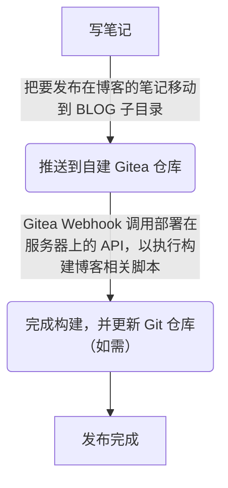

几年前我大一的时候，就开始折腾建站了。当时网站的内容主要是分享自己的专业学习笔记啥的。那时我的笔记和博客是一体的，建站工具是 Hexo，用到的编辑工具是 Typora ，并用 Git 做版本管理。发布在各种免费的 pages 服务上 。  

后来，发现了一个叫 Typecho 的博客系统，感觉挺不错的，就切换到它用了几个月，而后又发现了 halo，也是一个蛮好用的建站工具，也使用了一下。但很快我就对建站厌倦了（写笔记，然后 copy 到 blog 里这个过程让我感到有些烦躁），就关闭了我的网站，只在本地使用 Typora、VSCode 等写笔记，不再发布。  

一年后，我发现了另一个工具：Joplin，这是一个开源的笔记平台，支持通过多种方式同步，还有很多人为它开发插件，我体验了一下，觉得很好用，就把我的所有笔记迁移到了它上面。如此用了一年多。点名表扬 rxliuli 大佬的 [joplin-utils](https://github.com/rxliuli/joplin-utils) 系列小工具，里面有个叫 joplin-blog（现在应该是叫 mami 了）的工具可以很方便的导出笔记到 hexo 博客，极大的简化了博客发布流程。于是我又重拾了我的博客（发布在 Cloudflare Pages）。如此过了一年多。

本以为我不会再换工具了，后来了解到一个概念叫双链笔记，起初不怎在意，后来在使用 Joplin 过程中遇到一些问题，就又想起了这个词。就上网冲浪查询了一下相关资料，觉得这玩意不错，支持双链笔记的工具有很多，Obsidian、Logseq、思源，等等等等，对比了下，觉得 Obsidian 用着最顺手，就切换到了 Obsidian，并自己写了一些小脚本来自动化我的博客发布流程。

对了，说一下我在 Joplin 遇到的问题吧：

1. 恢复备份文件后，笔记的序列号会变，导致 joplin-blog 生成的 abbrlink 也发生变化。
2. 手机端的 app 有点丑。
3. 自建同步有几率会出问题。  

第 2 点还好，1 和 3 真的有点难顶🤣

切换到 Obsidian 后，我是这么发布我的博客的：笔记库内专门创建一个子目录存放要发布为博客的笔记，更新博客时在本地手动运行脚本将该目录下的笔记 copy 到 Hexo 博客的 `_posts` 目录下，并触发一系列流程（检测变动、格式化 md 文件、处理 front matter 等）最后将 Hexo 博客的源码 push 到 Github 仓库，触发 Action 构建博客，最后发布到 Cloudflare Pages 等。

由于那些免费的 Pages 服务都时常出现访问问题，遂将博客等网站转移到我在阿里云的服务器。迁移后又优化了下流程。现在可以更新笔记后自动触发执行服务器上的脚本，检测博客子目录产生的变动并进行一系列处理流程，自动发布博客，自此我可以专注于写笔记了。  

下面是现在的博客发布流程示意图

用 Actions/Jenkins 之类的 CI/CD 工具或许更方便，但现在也够用了，小服务器资源有限，先这么处理吧😂
